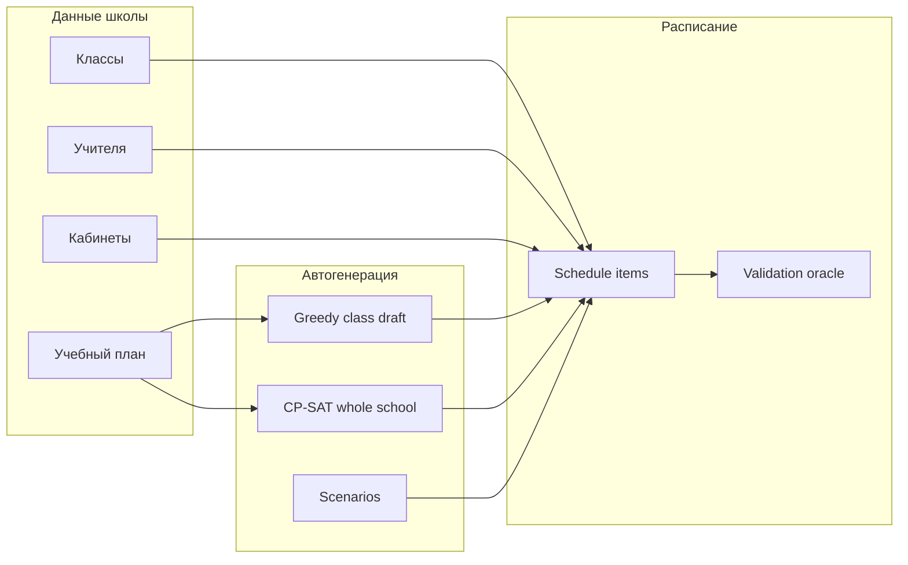

# Документация Atlas

Добро пожаловать в документацию **Atlas** — платформы для создания и сопровождения школьного расписания.

## Навигация

| Раздел | Для кого |
|--------|----------|
| [**Начало работы**](getting-started.md) | Все: запуск за 5 минут |
| [**Архитектура**](architecture.md) | Разработчики: как устроена система |
| [**Руководство пользователя**](user-guide.md) | Менеджеры школы, админы |
| [**Планирование и solver**](scheduling.md) | Автогенерация и правила |
| [**Справочник API**](api.md) | Интеграции, скрипты, отладка |
| [**Импорт Excel**](import.md) | Массовая загрузка данных |
| [**Локализация**](i18n.md) | kk / ru / en |
| [**Разработка**](development.md) | Тесты, CI, структура репозитория |
| [**Развёртывание**](deployment.md) | Production и Nginx |

## Ключевые понятия

| Термин | Значение |
|--------|----------|
| **Schedule item** | Одна ячейка расписания: класс + предмет + учитель + кабинет + слот |
| **Lesson slot** | Пара в конкретный день недели (день + номер урока + время) |
| **Curriculum / plan** | `class_subject_hours` — сколько часов в неделю нужно поставить |
| **Draft** | Несохранённые операции в UI (`create` / `update` / `delete`) |
| **Oracle** | `validate_schedule` — единый источник правды по конфликтам |
| **Frozen slot** | Слот, который solver не трогает (закреплён в UI) |

## Роли

| Роль | Возможности |
|------|-------------|
| **Admin** | Школы, назначение менеджеров, полный доступ |
| **School Manager** | Расписание, справочники, импорт, solver, аналитика |
| **Viewer** | Только просмотр |

## Быстрые ссылки

- OpenAPI (локально): http://localhost:18080/docs
- Health: http://localhost:18080/health
- Репозиторий: корневой [README](../README.md)

## История релизов

Итерации MVP (Foundation → Core Value → Completion) описаны в [архитектуре](architecture.md#эволюция-mvp). Актуальное поведение всегда определяется кодом и этой документацией, а не устаревшими планами.
