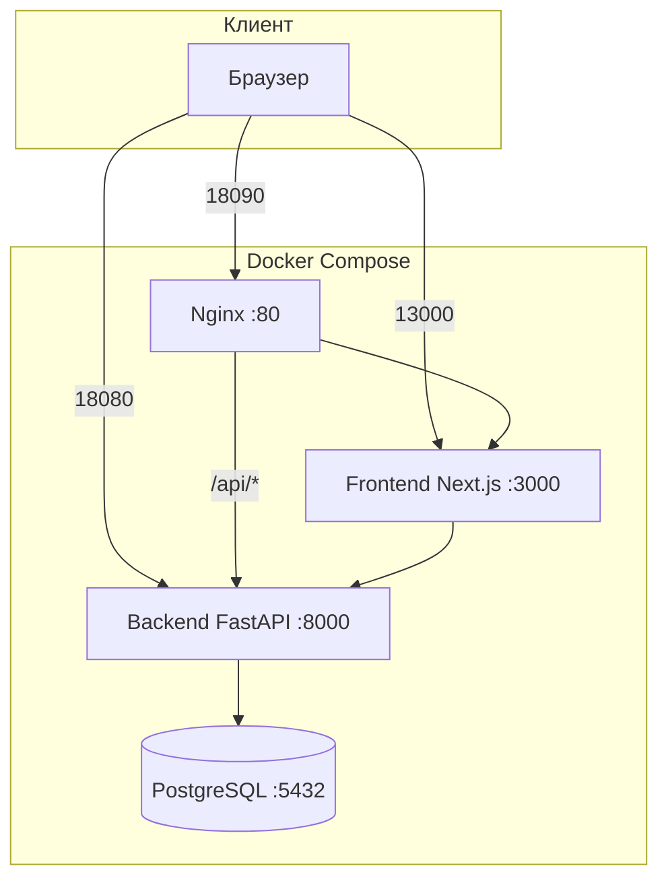
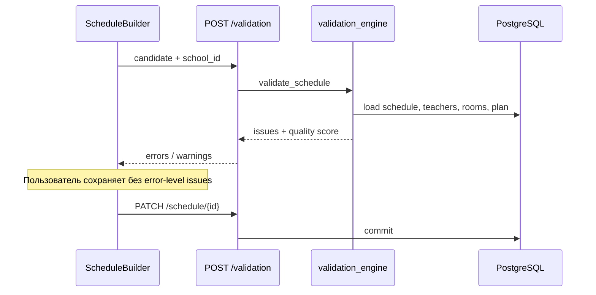
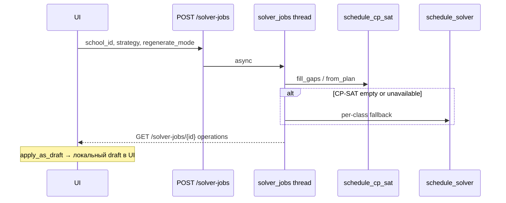

# Архитектура

## Обзор системы

Atlas — монорепозиторий с тремя прикладными сервисами и обратным прокси:



| Компонент | Технология | Ответственность |
|-----------|------------|-----------------|
| **frontend** | Next.js 15, App Router | UI, drag-and-drop, i18n, вызовы API |
| **backend** | FastAPI, SQLAlchemy 2 | REST, JWT, validation, solver jobs |
| **db** | PostgreSQL 16 | Персистентность |
| **nginx** | nginx:1.27 | Единая точка входа, прокси `/api` |

## Структура репозитория

```text
Atlas/
├── backend/
│   ├── app/
│   │   ├── api/           # Роутеры FastAPI
│   │   ├── core/          # config, db, security
│   │   ├── models/        # SQLAlchemy entities
│   │   ├── schemas/       # Pydantic DTO
│   │   ├── services/      # Бизнес-логика (solver, validation, import)
│   │   ├── i18n/          # Переводы ошибок API
│   │   └── scripts/seed.py
│   ├── alembic/           # Миграции
│   └── tests/
├── frontend/
│   ├── src/app/           # Страницы (schedule, curriculum, …)
│   ├── src/components/    # ScheduleBuilder, CRUD panels
│   └── messages/          # en.json, ru.json, kk.json
├── infra/nginx/
├── docs/
└── docker-compose.yml
```

## Поток данных: редактирование расписания



**Принцип:** любое перемещение карточки на сетке может вызывать `/validation` до сохранения. Solver и suggestions используют тот же oracle.

## Поток данных: автогенерация



Jobs хранятся **в памяти** процесса backend (in-process dict + thread). Для production-кластера потребуется внешняя очередь (Redis, Celery) — сейчас это осознанное MVP-ограничение.

## Слой домена

### Основные сущности

| Сущность | Таблица / API | Связь |
|----------|---------------|--------|
| School | `schools` | Корень тенанта; `scheduling_preferences` JSON |
| Subject | `subjects` | Глобальный каталог предметов |
| LessonSlot | `lesson_slots` | Слоты сетки (день, номер урока) |
| StudentClass | `classes` | Класс школы |
| Teacher | `teachers` | Предметы, лимит часов, недоступные дни |
| Classroom | `classrooms` | Вместимость, специализация |
| GroupFlow | `grouped_flows` | Совмещённые классы (физра, информатика) |
| ClassSubjectHours | `class_subject_hours` | План: часы/неделю |
| ScheduleItem | `schedule_items` | Фактическое расписание |

### Мультитенантность и безопасность

- JWT после `POST /auth/login`.
- Каждый запрос к ресурсам школы проверяет `school_id` и роль (`admin`, `school_manager`, `viewer`).
- Admin видит все школы; manager — только свою.

## Сервисы backend (ключевые)

| Модуль | Назначение |
|--------|------------|
| `validation_engine.py` | Oracle: все коды конфликтов, quality score |
| `constraint_catalog.py` | Веса и severity по умолчанию |
| `scheduling_preferences.py` | Разбор JSON настроек школы |
| `schedule_solver.py` | Greedy draft по классу, reoptimize, GA polish |
| `schedule_cp_sat.py` | Whole-school CP-SAT (OR-Tools) |
| `cp_sat_diagnostics.py` | Коды причин неразмещения |
| `solver_jobs.py` | Async jobs, fallback chain |
| `scenario_engine.py` | What-if сценарии → draft operations |
| `excel_import.py` | Импорт .xlsx |
| `schedule_exports.py` | XLSX / PDF |
| `schedule_quality.py` | Агрегация penalty |

## Frontend: страницы

| Путь | Назначение |
|------|------------|
| `/` | Дашборд: качество, план, быстрые действия |
| `/schedule` | Основной редактор сетки |
| `/curriculum` | Учебный план (часы по предметам) |
| `/teachers`, `/classrooms`, `/classes`, `/flows` | CRUD справочников |
| `/import` | Мастер импорта Excel |
| `/analytics` | Тепловые карты и метрики |
| `/workspace` | Рабочая область менеджера |

Центральный компонент — `ScheduleBuilder.tsx` (DnD, solver, сценарии, sandbox в `localStorage`).

## Эволюция MVP

| Итерация | Содержание |
|----------|------------|
| **A — Foundation** | Compose, схема БД, JWT, CRUD |
| **B — Core Value** | Сетка, DnD, `/validation`, базовые hard rules |
| **C — Completion** | Group flows, окна учителей, аналитика, тесты |
| **Post-MVP** | CP-SAT, solver jobs, сценарии, heatmaps, импорт |

## Масштабирование (направления)

- Вынести solver jobs в очередь с персистентным статусом.
- Read replicas для аналитики.
- WebSocket для прогресса job вместо polling.
- Отдельный worker-контейнер с OR-Tools для тяжёлых CP-SAT задач.

См. также [развёртывание](deployment.md) и [планирование](scheduling.md).
