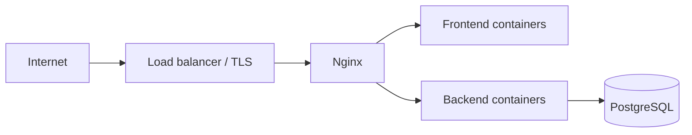

# Развёртывание

Руководство по выводу Atlas в окружение ближе к production. Локальная разработка — в [getting-started.md](getting-started.md).

## Архитектура развёртывания



Минимальный production-набор:

- PostgreSQL (управляемый сервис или отдельный VM).
- 1+ реплик backend (Uvicorn/Gunicorn).
- 1+ реплик frontend (standalone Next.js из Dockerfile).
- Nginx или cloud LB с TLS.

## Docker Compose (staging / demo)

Текущий `docker-compose.yml` рассчитан на **локальную разработку**:

| Риск | Рекомендация |
|------|----------------|
| `SECRET_KEY` в compose | Задать секрет через secrets / env file вне git |
| Postgres без бэкапов | Volume + регулярный dump |
| Solver jobs in-memory | Один replica backend или внешняя очередь |
| Порты на хост | Закрыть firewall, отдавать только 443 |

### Production checklist

- [ ] `ENVIRONMENT=production`
- [ ] `SECRET_KEY` — криптостойкий, не `change-me`
- [ ] `DATABASE_URL` — managed Postgres, SSL
- [ ] `CORS_ORIGINS` — только реальные origin UI
- [ ] `NEXT_PUBLIC_API_URL` — публичный URL API при сборке frontend
- [ ] TLS на Nginx (certbot / ACM)
- [ ] Healthcheck: `GET /health`
- [ ] Логирование и ротация логов контейнеров
- [ ] Бэкапы БД

## Сборка образов

```bash
docker compose build
# или отдельно:
docker build -t atlas-backend ./backend
docker build -t atlas-frontend \
  --build-arg NEXT_PUBLIC_API_URL=https://api.example.com \
  ./frontend
```

Frontend встраивает `NEXT_PUBLIC_*` на этапе **build** — при смене URL API образ нужно пересобрать.

## Nginx

Конфиг: `infra/nginx/default.conf`

```nginx
location /api/ {
  proxy_pass http://backend:8000/;
}
location / {
  proxy_pass http://frontend:3000/;
}
```

Для production добавьте:

- `proxy_set_header X-Forwarded-Proto $scheme;`
- rate limiting на `/auth/login`
- увеличенные таймауты для `/solver-jobs` (долгие CP-SAT)

## Переменные окружения

### Backend

| Переменная | Обязательна | Описание |
|------------|:-----------:|----------|
| `DATABASE_URL` | ✓ | PostgreSQL |
| `SECRET_KEY` | ✓ | JWT signing |
| `ENVIRONMENT` | ✓ | `production` включает строгие проверки |
| `CORS_ORIGINS` | | CSV origins |
| `ATLAS_SEED_*` | | Только для первого bootstrap |

### Frontend (build args)

| Переменная | Описание |
|------------|----------|
| `NEXT_PUBLIC_API_URL` | URL API для браузера |

## Миграции при деплое

1. Запустить новую версию backend с командой миграции **до** переключения трафика:

```bash
alembic upgrade head
```

2. В Docker — entrypoint уже вызывает Alembic; для Kubernetes используйте **init container** или Job.

## Масштабирование backend

**Ограничение MVP:** `solver_jobs` хранятся в памяти процесса.

| Стратегия | Когда |
|-----------|-------|
| 1 replica | Демо, малые школы |
| Sticky sessions + 1 worker с solver | Средняя нагрузка |
| Redis + worker queue | Production с частыми CP-SAT |

## Мониторинг

- Liveness: `GET /health`
- Метрики: добавить Prometheus middleware (не в MVP)
- Алерты на 5xx и время ответа `/solver-jobs`

## Откат

1. Откатить образ backend/frontend на предыдущий тег.
2. При обратно-несовместимой миграции — `alembic downgrade -1` (тестировать на staging).

## Итерации MVP (история)

| Итерация | Deliverables |
|----------|----------------|
| A | Compose, схема, auth, CRUD |
| B | Сетка, DnD, validation |
| C | Group flows, analytics, тесты |

Актуальное поведение — в [документации](README.md) и коде, не в устаревших планах.

## Admin Console

Внутренняя панель: frontend `/admin`, API `/admin/*` (только `role=admin`).

**Первый admin:** `python -m app.scripts.seed` создаёт `admin@atlas.example.com` (пароль `AtlasSeed!2026` по умолчанию, см. `ATLAS_SEED_ADMIN_*` в seed).

**Второй admin вручную:**

```sql
INSERT INTO users (email, full_name, password_hash, role, school_id)
VALUES ('ops@example.com', 'Ops', '<pbkdf2_hash>', 'admin', NULL);
```

Или дублировать логику `get_password_hash` из Python shell. После входа проверьте `GET /auth/me` → `role: admin`.

## См. также

- [Начало работы](getting-started.md)
- [Admin API](api.md#admin-api-internal-roleadmin-only)
- [Разработка](development.md)
- [Архитектура](architecture.md)
