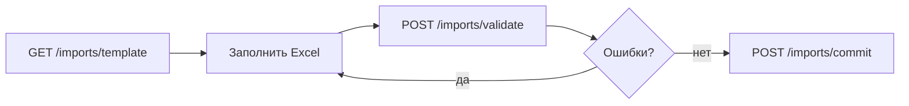

# Импорт Excel

Массовая загрузка и обновление данных школы через workbook `.xlsx` — без ручного ввода в каждую форму.

## Поток в три шага



| Шаг | Endpoint | Эффект |
|-----|----------|--------|
| 1 | `GET /imports/template?school_id=` | Скачать шаблон с листами по сущностям |
| 2 | `POST /imports/validate` | Dry-run: issues + summary, **без записи в БД** |
| 3 | `POST /imports/commit` | Одна транзакция; откат при любой error |

## Multipart-поля

Оба POST принимают:

| Поле | Тип | Обязательно |
|------|-----|:-----------:|
| `school_id` | form | ✓ |
| `file` | file (.xlsx) | ✓ |
| `modes` | JSON string | |

Пример `modes`:

```json
{
  "Schedule": "replace",
  "Teachers": "upsert",
  "Curriculum": "replace"
}
```

## Режимы по листу

| Режим | Поведение |
|-------|-----------|
| `upsert` | Обновить по natural key или вставить (default для справочников) |
| `replace` | Удалить все строки школы на листе и загрузить заново (default для `Schedule`) |
| `append` | Только insert; совпадения → `skipped` |
| `skip` | Лист игнорируется |

## Структура workbook

Каждый лист данных:

| Строка | Содержание |
|--------|------------|
| 1 | Имена колонок (machine names) |
| 2 | Подсказки (`# ...`) — **игнорируются** |
| 3 | Зелёный баннер (`# ...`) — **игнорируется** |
| 4+ | Данные |

Пустые строки пропускаются.

### Листы и ключи

| Лист | Natural key | Колонки |
|------|---------------|---------|
| `Subjects` | `name` (глобально) | `name`, `requires_special_room`, `required_specialization` |
| `LessonSlots` | `day_of_week` + `lesson_number` | `day_of_week`, `lesson_number`, `start_time`, `end_time` |
| `Classes` | `class_name` | `class_name`, `students_count` |
| `Teachers` | `full_name` | `full_name`, `subjects`, `weekly_load_limit`, `unavailable_days` |
| `Classrooms` | `room_number` | `room_number`, `capacity`, `specialization` |
| `GroupFlows` | `group_name` | `group_name`, `combined_classes` |
| `Curriculum` | `class_name` + `subject_name` | `class_name`, `subject_name`, `hours_per_week` |
| `Schedule` | `class_name` + день + урок | `class_name`, `subject_name`, `teacher_full_name`, `room_number`, `day_of_week`, `lesson_number`, `is_grouped`, `group_name` |

### Форматы

- **Boolean:** `true/false`, `yes/no`, `1/0`, `да/иә`
- **Списки:** через запятую (`subjects`, `unavailable_days` как `1..7`)
- **Ссылки:** лист `Schedule` может ссылаться на учителя с листа `Teachers` в том же файле

## Права доступа

| Роль | Доступ |
|------|--------|
| `admin`, `school_manager` | ✓ |
| `viewer` | `403 errors.insufficientPermissions` |

Manager может импортировать только в **свою** школу (`403 errors.crossSchoolAccessDenied`).

## Коды ошибок validate

Каждый issue: `sheet`, `row`, `column`, `severity`, `code`, `message`.

| Код | Типичная причина |
|-----|------------------|
| `missing_column`, `required`, `duplicate` | Структура / данные |
| `invalid_int`, `invalid_time`, `invalid_day`, `invalid_enum` | Неверный формат |
| `unknown_class`, `unknown_subject`, `unknown_teacher`, `unknown_room`, `unknown_slot`, `unknown_flow` | Ссылка на несуществующую сущность |
| `group_ignored` | warning: `group_name` без `is_grouped` |

**Commit** при любой `error` в issues: `committed: false`, `applied: []`.

## UI

- Страница: `/import`
- Компонент: `frontend/src/components/import/ImportWizard.tsx`

Мастер: скачать шаблон → загрузить файл → preview с режимами по листам → подтверждение commit.

## Рекомендации

1. Всегда вызывайте **validate** перед commit.
2. Для полной пересборки расписания: `"Schedule": "replace"`.
3. Для обновления плана без трогания сетки: `"Curriculum": "upsert"`, `"Schedule": "skip"`.
4. Сохраняйте строки 2–3 шаблона с префиксом `#`, иначе они могут попасть в валидацию как данные.

См. [руководство пользователя](user-guide.md) и [API](api.md#import).
