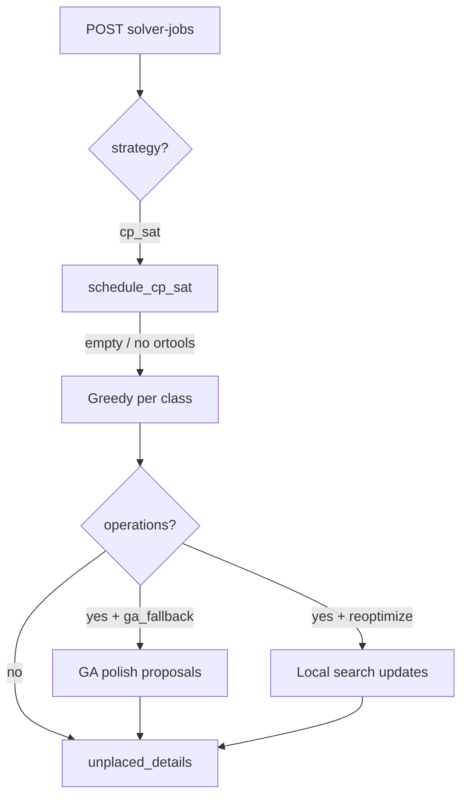

# Планирование и solver

Как Atlas проверяет расписание, генерирует черновики и интерпретирует настройки школы.

## Validation oracle

`validate_schedule(db, school_id, candidate_item_or_none)` — **единый источник правды** для:

- подсветки конфликтов в UI;
- quality score на дашборде;
- проверки предложений solver перед выдачей операций.

### Hard constraints (error)

| Код | Смысл |
|-----|--------|
| `TEACHER_DOUBLE_BOOKING` | Учитель в двух местах в один слот |
| `CLASSROOM_DOUBLE_BOOKING` | Кабинет занят дважды |
| `CLASS_DOUBLE_BOOKING` | Класс в двух уроках (кроме согласованного group flow) |
| `TEACHER_SUBJECT_MISMATCH` | Учитель не ведёт этот предмет |
| `ROOM_CAPACITY_EXCEEDED` | Класс не помещается в кабинет |
| `SPECIAL_ROOM_MISMATCH` | Предмет требует спецкабинет |
| `GROUP_CAPACITY_EXCEEDED` | Поток переполнен |
| `TEACHER_UNAVAILABLE_DAY` | Учитель недоступен в этот день |
| `SCHOOL_EVENT_BLOCK` | Блокировка школьного события |

### Soft constraints (warning)

| Код | Смысл |
|-----|--------|
| `TEACHER_WINDOW_DETECTED` | «Окно» в расписании учителя |
| `TEACHER_LOAD_LIMIT_EXCEEDED` | Превышен недельный лимит часов |
| `PLAN_UNDERFILLED` | По плану не хватает часов |
| `PLAN_OVERFLOW` | По плану часов больше, чем в сетке |
| `SUBJECT_TEACHER_INCONSISTENT` | Разные учителя на один (класс, предмет) |
| `CLASS_SHIFT_MISMATCH` / `TEACHER_SHIFT_MISMATCH` | Сменность |
| `LANGUAGE_STREAM_MISMATCH` | Языковой поток |

Веса по умолчанию — в `backend/app/services/constraint_catalog.py`. Школа может переопределить через `scheduling_preferences.issue_weights`.

### Quality score

`POST /validation` возвращает:

```json
{
  "issues": [...],
  "quality": {
    "total_penalty": 1234.5,
    "breakdown": { "TEACHER_DOUBLE_BOOKING": 10000, ... }
  }
}
```

Чем ниже penalty — тем лучше. Hard errors обычно дают очень большой вес.

## Настройки школы (`scheduling_preferences`)

JSON на модели `School`. Неизвестные ключи игнорируются.

| Ключ | Значения | Эффект |
|------|----------|--------|
| `plan_compliance` | `warn` (default), `error` | Сeverity для `PLAN_*` |
| `subject_teacher_consistency` | `off`, `warn`, `error` | Один учитель на (класс, предмет) |
| `issue_weights` | `{ "CODE": number }` | Веса в quality score |
| `solver_objective` | см. ниже | Мягкие цели CP-SAT |

### Soft objective CP-SAT

```json
{
  "solver_objective": {
    "earlier_slot": 1,
    "room_stability": 2,
    "subject_variety": 3
  }
}
```

| Термин | Назначение |
|--------|------------|
| `earlier_slot` | Предпочитать более ранние слоты в дне |
| `room_stability` | Меньше смен кабинета у класса |
| `subject_variety` | Разносить один предмет по разным дням |

## Greedy draft по классу

`POST /suggestions/generate-class` → `generate_draft_for_class` в `schedule_solver.py`.

**Не глобальный оптимизатор** — пошаговый first-fit:

1. Берёт строки `class_subject_hours` для класса.
2. Сначала предметы **без** спецкабинета (чтобы лаборатории не блокировали весь черновик).
3. Для каждого часа ищет (учитель, слот, кабинет), проходящий `validate_schedule` с уже набранными proposals.
4. Неразмещённые часы → `unplaced` с `blocking_issues` с **первой** неудачной попытки.

Согласованность имён предметов с учителем: `subject_teacher_match.py` (алиасы PE/Math/Chem и т.д.).

## Solver jobs (async)

### Создание

```http
POST /solver-jobs
Content-Type: application/json

{
  "school_id": 1,
  "class_id": null,
  "strategy": "cp_sat",
  "regenerate_mode": "fill_gaps",
  "frozen_lesson_slot_ids": [12, 15],
  "max_runtime_seconds": 20,
  "deterministic_seed": 42,
  "apply_as_draft": true
}
```

### Параметры

| Поле | Описание |
|------|----------|
| `class_id` | `null` — вся школа; иначе только класс |
| `strategy` | `cp_sat`, `ga_fallback`, `reoptimize` |
| `regenerate_mode` | `fill_gaps` — только недостающие часы; `from_plan` — очистить scope и собрать заново |
| `frozen_lesson_slot_ids` | ID слотов, которые нельзя менять |
| `apply_as_draft` | `true` — только операции в ответе; `false` — UI может сразу persist (school-wide) |

### Статус

```http
GET /solver-jobs/{job_id}
POST /solver-jobs/{job_id}/cancel
```

Ответ включает `operations`, `unplaced_details`, `quality`, `progress`, `error`.

### Цепочка fallback



| Strategy | Поведение |
|----------|-----------|
| `cp_sat` | Whole-school CP-SAT; при пустом результате — greedy; при отсутствии OR-Tools — сразу greedy |
| `ga_fallback` | Полировка **уже существующих** proposals (не создаёт с нуля) |
| `reoptimize` | Локальный поиск `update` по текущему расписанию |

### CP-SAT scope

`schedule_cp_sat.py` размещает недостающие часы плана с hard constraints:

- конфликты класс / учитель / кабинет;
- квалификация учителя и недоступные дни;
- спецкабинеты и вместимость;
- **глобальный** недельный лимит учителя;
- **subject_teacher_consistency** (один учитель на пару класс+предмет, если включено);
- grouped flow capacity.

Выход — список операций `{ "type": "create", "payload": ScheduleItemIn }`.

### Диагностика неразмещения

`unplaced_details[]`:

```json
{
  "subject_id": 3,
  "subject_name": "Chemistry",
  "class_ids": [5],
  "hours_missing": 2,
  "blocking_issues": ["SPECIAL_ROOM_MISMATCH", "TEACHER_LOAD_LIMIT_EXCEEDED"]
}
```

Коды формирует `cp_sat_diagnostics.py` и greedy-путь.

## Сценарии (what-if)

`POST /suggestions/scenario-draft` — **без записи в БД**, только draft operations.

| scenario | Назначение | Ключевые поля |
|----------|------------|----------------|
| `teacher_absent` | Снять или заменить уроки учителя | `teacher_id`, `day_of_week`, `substitute_teacher_id` |
| `substitute_teacher` | Массовая замена | `original_teacher_id`, `substitute_teacher_id` |
| `shortened_day` | Уроки после N-го снимаются | `max_lesson_number`, `day_of_week` |
| `room_unavailable` | Кабинет недоступен | `classroom_id`, `day_of_week` |
| `emergency_free` | Освободить слот | `lesson_slot_id`, `class_id` |

Ответ: `{ "operations": [...], "issues": [...] }`.

## Pick slot

`POST /suggestions/slots` — ранжирование пар (слот, кабинет) для **кандидата** урока с penalty по oracle.

## Контракт solver (для интеграторов)

**Вход:**

- согласованный снимок БД (`school_id`);
- scope (школа / класс);
- опционально frozen slots и `scheduling_preferences`.

**Выход:**

- операции, совместимые с draft UI (`create` / `update` / `delete`);
- опционально `quality` после применения к виртуальному состоянию.

**Oracle** остаётся финальной проверкой для пользователя.

## Ограничения v1 (честно)

| Тема | Ограничение |
|------|-------------|
| Greedy | Не cost-optimal по всей неделе |
| Jobs | In-memory, один процесс backend |
| GA | Не генерирует расписание с нуля |
| Ротация | Нет продукта «2-недельная сетка» |
| Sandbox | Только `localStorage` браузера |

## См. также

- [API](api.md) — точные пути и схемы
- [Руководство пользователя](user-guide.md) — кнопки в UI
- [Архитектура](architecture.md) — потоки данных
