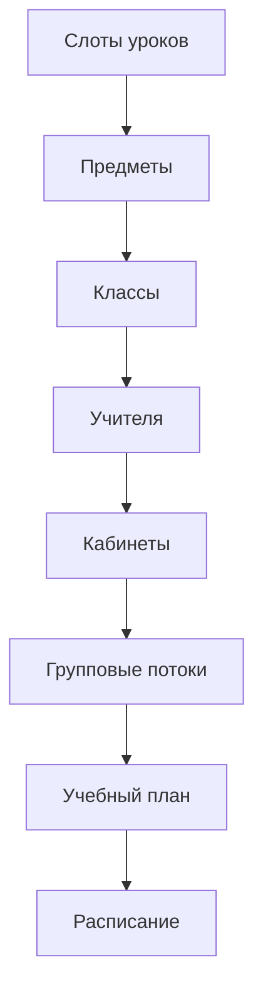

# Руководство пользователя

Руководство для **School Manager** и **Admin**: как вести справочники, собирать расписание и пользоваться автогенерацией.

## Роли и доступ

| Действие | Admin | School Manager | Viewer |
|----------|:-----:|:--------------:|:------:|
| Просмотр расписания | ✓ | ✓ | ✓ |
| Редактирование расписания | ✓ | ✓ | — |
| CRUD учителей / кабинетов / классов | ✓ | ✓ | — |
| Импорт Excel | ✓ | ✓ | — |
| Solver / сценарии | ✓ | ✓ | — |
| Настройки школы (JSON prefs) | ✓ | ✓ | — |
| Управление школами | ✓ | — | — |

## Быстрый старт (рекомендуется)

1. Войдите как **School Manager**.
2. Откройте **`/start`** — мастер «Начать».
3. Загрузите Excel-шаблон (`GET /imports/template`), заполните листы (расписание можно пропустить).
4. Проверка → импорт → переход в **Расписание**.
5. На **дашборде** смотрите **готовность школы** (GREEN / YELLOW / RED) и три главных блокера.

## Рекомендуемый порядок настройки школы (расширенный)

1. **Слоты** — рабочие дни и номера уроков (в демо уже Mon–Fri).
2. **Классы** — параллели и численность.
3. **Учителя** — ФИО, предметы, лимит часов в неделю, недоступные дни.
4. **Кабинеты** — номер, вместимость, специализация (химия, информатика).
5. **Потоки** — если несколько классов идут вместе на один урок.
6. **Учебный план** (`/curriculum`) — сколько часов в неделю по каждому предмету в классе.
7. **Расписание** (`/schedule`) — ручная сборка или автогенерация.

Альтернатива: [импорт Excel](import.md) заполняет несколько листов за один раз.

## Главная страница

Дашборд показывает:

- **Качество расписания** — суммарный штраф и разбивка по кодам (`POST /validation`).
- **Покрытие плана** — `GET /schedule-plan-status`: запланировано vs фактически по классам.
- Быстрые ссылки на расписание и учебный план.

## Редактор расписания

### Сетка

- Оси: дни × уроки; карточки — занятия (класс, предмет, учитель, кабинет).
- **Перетаскивание** — смена слота; перед сохранением проверка конфликтов.
- **Undo** — отмена последних действий в сессии редактора.

### Сохранение и черновик

- Локальные изменения накапливаются как **draft** (операции `create` / `update` / `delete`).
- Кнопка сохранения отправляет изменения на API только когда нет **error**-уровня валидации.
- Режим **«Только черновик для школы»** — результат solver не пишется в БД автоматически; вы просматриваете и применяете вручную.

### Полезные действия в тулбаре

| Действие | Описание |
|----------|----------|
| **Pick slot** | `POST /suggestions/slots` — лучшие слоты и кабинеты для новой карточки |
| **По плану (черновик)** | Greedy-черновик для выбранного класса по `class_subject_hours` |
| **Solver job** | CP-SAT / reoptimize / GA — см. [scheduling.md](scheduling.md) |
| **Сценарии** | Отсутствие учителя, сокращённый день и др. |
| **Sandbox** | Именованные снимки черновика в браузере (`localStorage`) |
| **Экспорт PDF** | Список уроков учителя (не полная сетка) |

### Закрепление слотов (freeze)

В карточке урока можно **закрепить** слот — его `lesson_slot_id` попадёт в `frozen_lesson_slot_ids` при solver job. Закреплённые ячейки solver не перемещает.

## Учебный план

Страница `/curriculum`:

- Таблица «класс × предмет → часов в неделю».
- Статус **недобор** / **перебор** относительно фактического расписания (связано с `PLAN_UNDERFILLED` / `PLAN_OVERFLOW`).

Перед whole-school CP-SAT убедитесь, что план согласован с реальными ресурсами (учителя, кабинеты, слоты).

## Групповые потоки

На `/flows` задаются потоки: несколько классов, один учитель и кабинет в одном слоте.

Валидация учитывает **ёмкость потока** (`GROUP_CAPACITY_EXCEEDED`). В расписании отметьте `is_grouped` и `group_name`.

## Аналитика

`/analytics`:

| Виджет | API |
|--------|-----|
| Нагрузка учителей | `GET /analytics/teachers` |
| Использование кабинетов | `GET /analytics/rooms` |
| Качество | `GET /analytics/schedule-quality` |
| Матрица нагрузки | `GET /analytics/teacher-load-matrix` |
| Загрузка по дням | `GET /analytics/day-congestion` |
| «Усталость» класса | `GET /analytics/class-fatigue` |

Тепловые карты помогают увидеть перегруженные дни и учителей.

## Импорт и экспорт

- **Импорт:** [import.md](import.md) — шаблон `.xlsx`, validate → commit.
- **Экспорт:** `GET /schedule-exports` — параметры `school_id`, `scope` (`class` | `teacher` | `school`), `format` (`xlsx` | `pdf`).

## Настройки школы

На дашборде — JSON-редактор **Scheduling preferences** (`PATCH /schools/{id}`).

Ключевые параметры описаны в [scheduling.md#настройки-школы](scheduling.md#настройки-школы-scheduling_preferences).

## Типовые сценарии

### Новая школа с нуля

1. Импорт шаблона Excel **или** ручной CRUD.
2. Заполнить учебный план.
3. `POST /solver-jobs` с `regenerate_mode=from_plan`, `strategy=cp_sat`, `apply_as_draft=true`.
4. Просмотреть черновик, исправить `unplaced_details`, сохранить.

### Добавить только недостающие часы

`regenerate_mode=fill_gaps` (по умолчанию) — существующие ячейки не удаляются.

### Учитель заболел

Сценарий **teacher_absent** или **substitute_teacher** → черновик с заменами → проверка → сохранение.

### Сокращённый день

**shortened_day** с `max_lesson_number` — уроки после N-го урока снимаются в черновике.

### Кабинет недоступен

**room_unavailable** — перенос или снятие занятий в указанном кабинете.

## Что пока не в продукте

- Автоматическая многонедельная ротация.
- PDF полной сетки класса (есть list-PDF учителя и XLSX).
- Облачный sandbox между устройствами (только localStorage).

Подробности solver — в [scheduling.md](scheduling.md).
